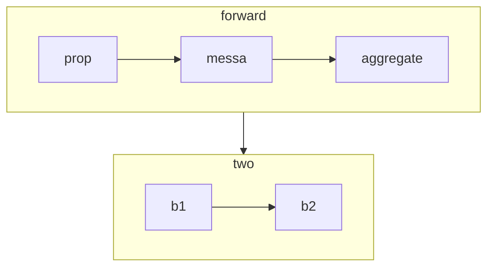

CS224W学习

 GraphSAGE，这是一个通用的归纳框架，它利用节点特征信息（例如，文本属性）来有效地为以前看不见的数据生成节点嵌入。我们不是为每个节点训练单独的嵌入，而是学习一个函数，该函数通过从节点的本地邻域采样和聚合特征来生成嵌入。我们的算法在三个归纳节点分类基准上优于强基线. 2017年发表.

#### 运行环境

python 3.9.7 

```
torch_geometric.__version__ 等于 2.0.3
```

参考 https://github.com/hdvvip/CS224W_Winter2021/blob/main/CS224W_Colab_2.ipynb

lec7 的ppt 37页讲了GraphSAGE的原理

我们已经建造了GNN 模型, 用PyG内置的GCN conv 

这次, 我们看看graphSAGE和GAT, 搭建一个多层GNN 运行在CORA 数据集上. the Cora graph has 2708 nodes, 5429 edges, 7 prediction classes, and 1433 features per node.

### 设计原创message passing 层

执行三个函数, forward, message, aggregate.

消息传递, 就是更新feature vector

1. 每个节点通过边传递消息
2. 聚合消息
3. transform 信息

#### forward

handle 预处理等, 初始化消息传递

1. 调用propagate函数 来传递消息
2. 更新node embedding, 从前面层skip connection
3. 可能还有正则化.



##### 传播函数

propagate函数封装了消息传递的过程, 调用 message, aggregate 和update .我们不会明确地实现更新，而是将更新节点嵌入的逻辑放在消息传递之后，放在转发函数中。更具体地说，在信息传播（消息传递）之后，我们可以进一步转换由propagate输出的节点嵌入。因此，forward的输出正是一个GNN层之后的节点嵌入。

```
def propagate(edge_index, x=(x_i, x_j), extra=(extra_i, extra_j), size=size):
```

Calling `propagate` initiates the message passing process. 

- `edge_index` is passed to the forward function and captures the edge structure of the graph.

- `x=(x_i, x_j)` represents the node features that will be used in message passing. 为啥传参数 the tuple `(x_i, x_j)`?    we first look at how our edges are represented. For every edge (i,j)∈E, we can differentiate i as the source or central node (xcentral) and j as the neighboring node (xneighbor).

  以上面的消息传递为例，对于一个中心节点u，我们将汇总并转换所有与节点相关的消息 v s.t. (u,v)∈E (i.e. v∈Nu). the subscripts `_i` and `_j` 允许我们具体区分与中心节点（即接收消息信息的节点）和邻近节点（即传递消息的节点）相关的特征。

  这绝对是一个有点令人困惑的概念；然而，要记住的一个关键问题是，根据不同的视角，一个节点X作为中心节点或邻近节点。 在无向图中我们也存边的方向 (i.e. (i,j) and (j,i)). 从中心节点 的视角, `x_i`, x is collecting neighboring information to update its embedding. 从邻近节点的视角, `x_j`, x is passing its message information along the edge connecting it 到另一个中心节点.

- `extra=(extra_i, extra_j)`代表额外的信息，我们可以在每个节点的当前特征嵌入之外与之关联。事实上，我们可以包括任意多的`param=(param_i, param_j)`形式的额外参数。我们再次强调，用`_i `和`_j `做索引可以让我们区分中心节点和相邻节点。

 `propagate` 函数的输出is a matrix of node embeddings after the message passing process and has shape [N,d].

##### message 函数

函数由propagate调用，为edge_index中的每条边(i,j)构建从邻近节点j到中心节点i的消息。这个函数可以接受最初传递给propagate的任何参数。此外，我们可以再次通过在变量名称后面加上_i或_j来区分中心节点和相邻节点，.例如x_i和x_j。更具体地看一下这些变量，我们有

1. x_j代表所有相邻节点沿着各自的边传递信息的特征嵌入矩阵（即边（i,j）∈E的所有节点j）。因此，它的形状是[|E|,d] !
2. 在实现GAT时，我们将看到如何访问传递给传播的额外变量

我们看到消息函数的输出是一个准备好被聚合的相邻节点嵌入的矩阵，其形状为[|E|,d] 。

pool的方法: message是用MLP, 然后agg的时候再取mean

##### aggregate 函数

```python
def aggregate(self, inputs, index, dim_size = None):
```

最后，聚合函数用于聚合来自相邻节点的信息。看一下这些参数，我们就会发现。

inputs表示从相邻节点传来的消息的矩阵（即消息函数的输出）
index的形状与inputs相同，告诉我们与inputs矩阵中的每一行/信息j相对应的中心节点。因此，index告诉我们每个中心节点要聚合哪些行/信息。
聚合的输出形状为[N,d] 。

好难, 想不出来. 

#### GraphSage Implementation

第一个GNN layer, 我们搭建GraphSage, 2017年的论文

在实施这一更新规则之前，我们鼓励你思考上述公式的不同部分如何与前面概述的功能相对应。1）转发，2）消息，和3）聚合。

现在问题来了，每个邻居节点传递的消息是什么，我们何时调用传播函数？

我觉得传递的是嵌入.

注意：在这种情况下，消息函数或消息其实很简单。此外，请记住，传播函数封装了/综合消息和聚合函数的输出的操作。

最后，每次迭代后都要对节点嵌入进行ℓ-2归一化。

forward 继承了[`MessagePassing`](https://pytorch-geometric.readthedocs.io/en/latest/modules/nn.html#torch_geometric.nn.conv.message_passing.MessagePassing) 基类, 

```
Update our node embedding with skip connection from the previous layer. 
这个怎么做? 
```

ogbg-molhiv

Maximum test set accuracy: 0.81
Minimum loss: 0.10113336145877838

ogbg-arxiv

500/500 [00:41<00:00, 12.09Epochs/s]
Maximum test set accuracy: 0.802
Minimum loss: 0.09549860656261444
